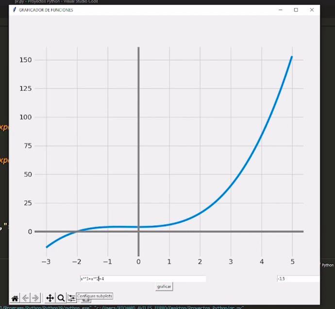

# GRAFICADOR DE FUNCIONES LINEALES

## Cuando la entrada (variable independiente) y la salida (variable dependiente) son números reales, una función puede representarse en una gráfica de coordenadas. La entrada se grafíca en el eje x y la salida se grafíca en el eje y. Un primer paso para graficar una función es hacer una tabla de valores

## EJEMPLO DE GRAFICADOR DE FUNCIONES LINEALES

### En el ejemplo que realize hay una variable cuya característica principal de la función lineal es que su representación gráfica es dada siempre por líneas rectas en el plano cartesiano, que pase por el origen.
